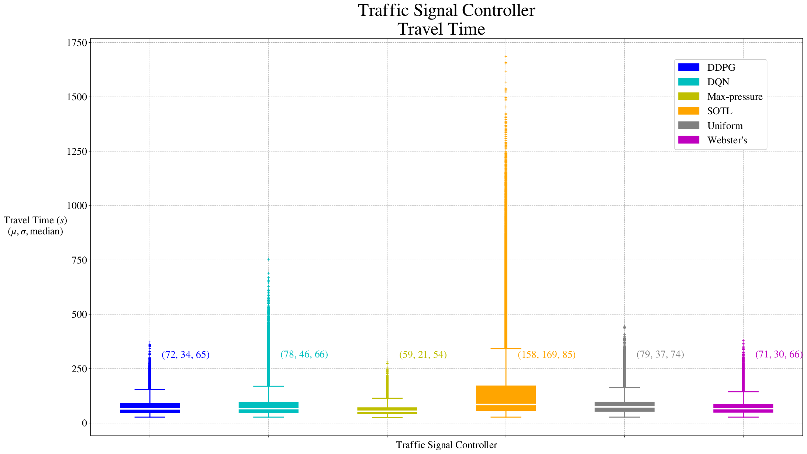
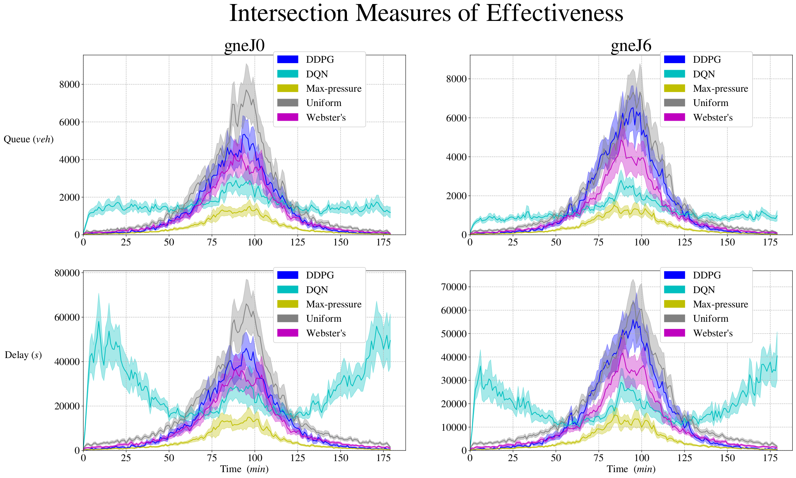
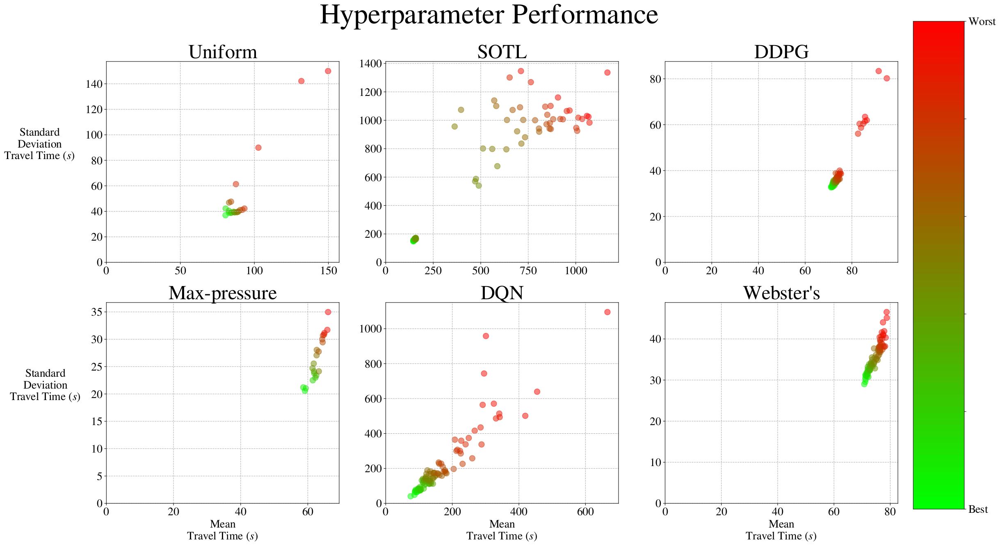
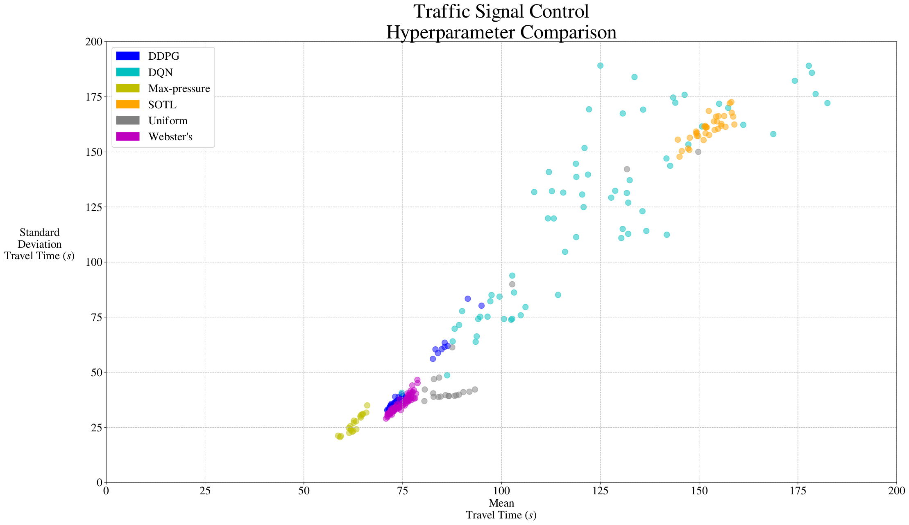

# sumolights
SUMO adaptive traffic signal control - DQN, DDPG, Webster's, Max-pressure, Self-Organizing Traffic Lights

Technical details available in manuscript [An Open-Source Framework for Adaptive Traffic Signal Control](http://wadegenders.com/wp-content/uploads/2019/09/an_open-source_framework_for_adaptive_traffic_signal_control.pdf)

## Setup

Install SUMO traffic microsimulator by [following instructions here](https://sumo.dlr.de/wiki/Installing) (v1.2).

Using Python 3, create a virtual environment and then install dependancies with:
```
pip install -r requirements.txt
```

## Comparing adaptive traffic signal controllers
First train reinforcement learning controllers:
```
./train_dqn.sh
./train_ddpg.sh
```

Then execute simulations to generate performance results for all controllers:
```
./gen_results.sh
```

Visualize results with:
```
python graph_results.py
```



## Optimizing hyperparameters
Search for optimal hyperparameters for each controller:
```
./hp_optimization
```
Warning, search for reinforcement learning can require significant compute time!

Visualize hyperparameters with:
```
python graph_results.py -type hp
```


